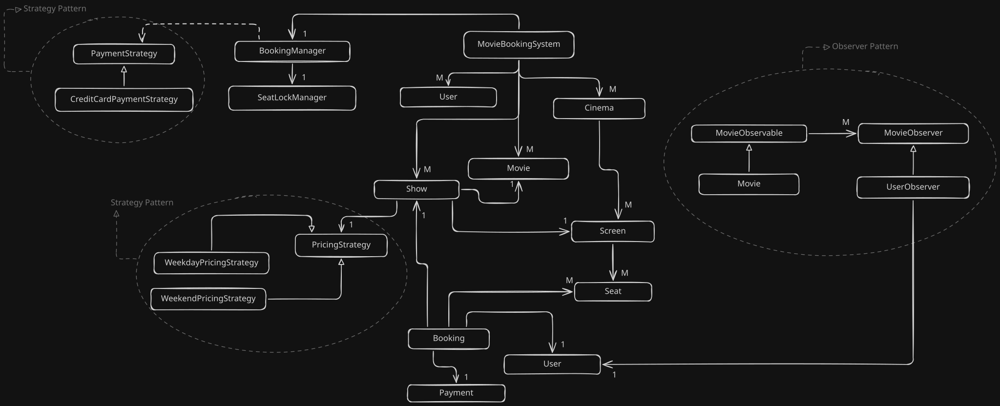
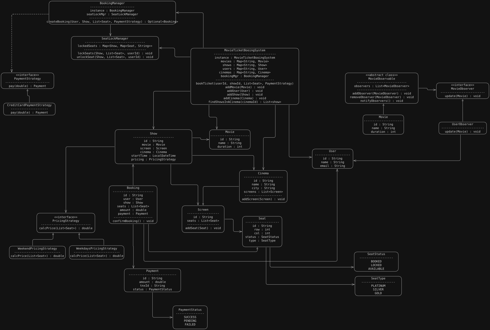

# Requirements

1. **Movie Management:**
   - Store movie information (title, duration, language)
   - Manage movie schedules and shows
   - Track movie availability

2. **Theater Management:**
   - Manage theater information
   - Handle multiple shows per theater
   - Track theater capacity

3. **Show Management:**
   - Schedule shows for movies
   - Manage show timings
   - Handle show availability

4. **Seat Management:**
   - Track seat availability
   - Handle seat selection
   - Manage different seat types

5. **Booking Management:**
   - Process parkingTicket bookings
   - Handle booking cancellations
   - Manage booking status

# Classes

# UML Diagram
