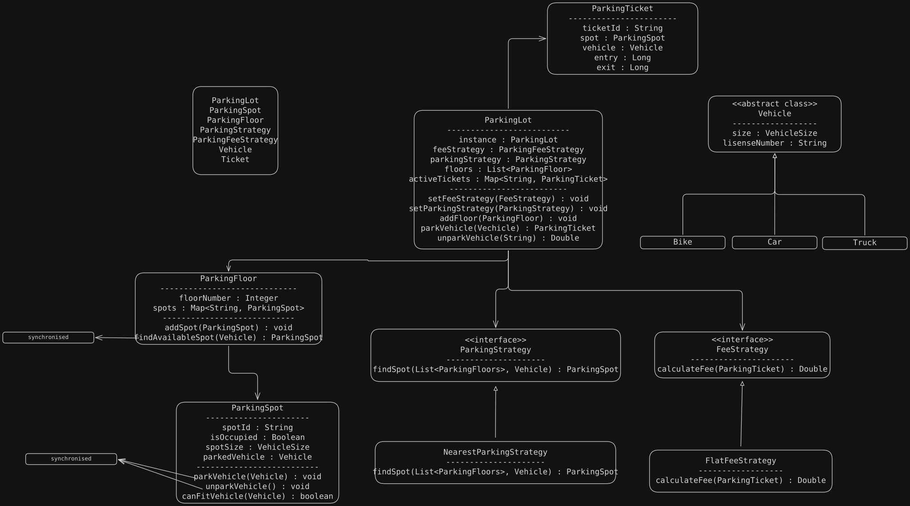

# Requirements

- **Multiple Floors:** The parking lot can have multiple floors.
- **Parking Spots:** Each floor has multiple parking spots of different types (e.g., car, bike, truck).
- **Vehicle Types:** Support for different vehicle types.
- **Ticketing:** Generate a parkingTicket when a vehicle is parked.
- **Unparking:** Allow vehicles to unpark and calculate the parking fee.
- **Fee Calculation:** Support for different fee strategies.
- **Spot Allocation:** Support for different parking strategies, nearest or farthest allocation.
- **Extensibility:** Easy to add new vehicle types, spot types, or fee strategies.

# UML Diagram
