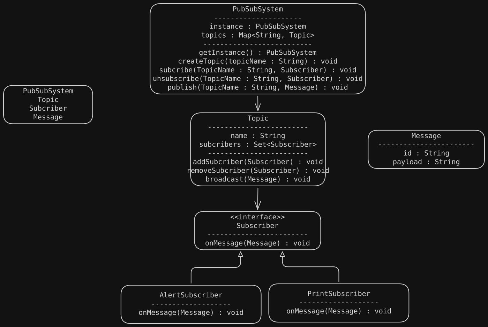

# Requirements
- **Topics:** The system supports multiple topics.
- **Publishers:** Publishers can publish messages to any topic.
- **Subscribers:** Subscribers can subscribe to one or more topics and receive messages published to those topics.
- **Multiple Subscribers:** Each topic can have multiple subscribers.
- **Asynchronous Delivery:** Messages are delivered to subscribers asynchronously.
- **Unsubscribe:** Subscribers can unsubscribe from topics.
- **Extensibility:** Easy to add new subscriber types or message processing logic.

# UML Diagram
