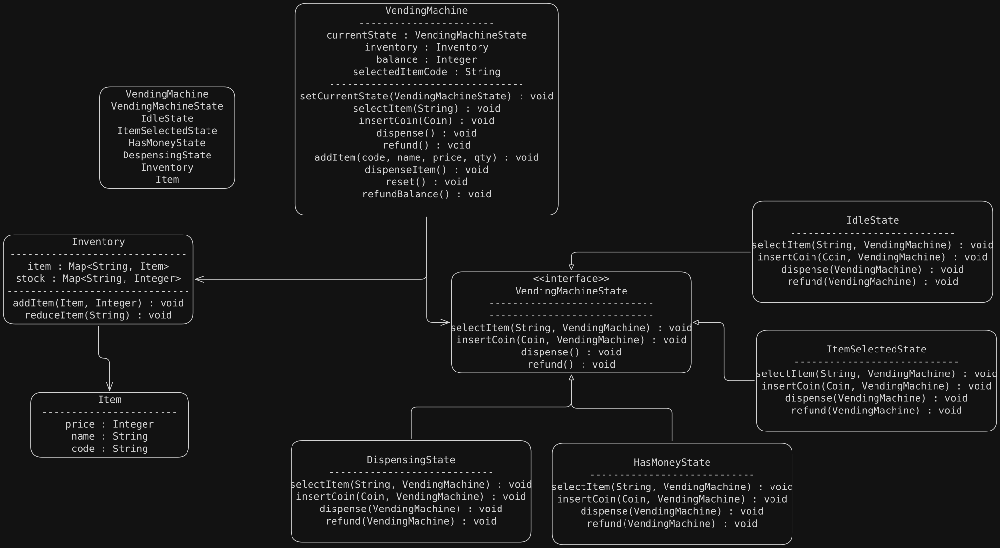

## Requirements

- **Product Management:** The system manages a catalog of products, each with a price and available quantity.
- **Inventory Management:** The system tracks the quantity of each item and prevents dispensing if out of stock.
- **Payment Handling:** The system accepts coins and notes, tracks total payment, and returns change if necessary.
- **State Management:** The system uses the State design pattern to manage its operational states (Idle, Ready, Dispense, ReturnChange).
- **User Interaction:** Users can select products, insert coins/notes, and receive products and change.
- **Extensibility:** Easy to add new item types, payment methods, or states.

# UML
