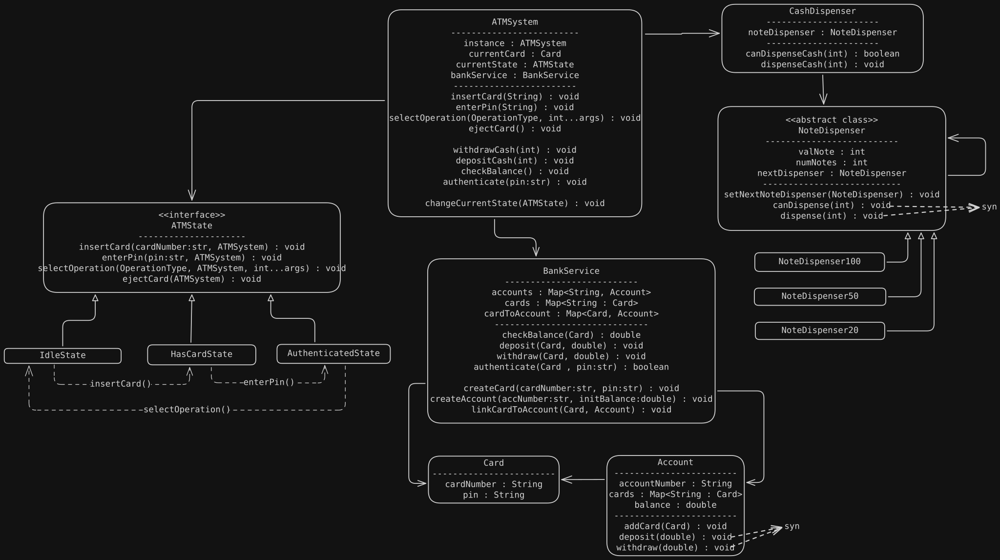

# Requirements

- **User Authentication:** Users must authenticate using a card and PIN.
- **Balance Inquiry:** Users can check their account balance.
- **Cash Withdrawal:** Users can withdraw cash if sufficient balance and cash are available.
- **Cash Deposit:** Users can deposit cash into their account.
- **Transaction Management:** The system records and processes transactions (withdrawal, deposit).
- **Banking Service Integration:** The ATM interacts with a backend banking service to validate accounts and perform transactions.
- **Cash Dispenser:** The ATM manages its own cash inventory and dispenses cash securely.
- **Concurrency & Consistency:** The system handles concurrent access and ensures data consistency.
- **User Interface:** The ATM provides a user-friendly interface for operations.
- **Extensibility:** Easy to add new features such as mini-statements, fund transfers, or multi-currency support.

# UML diagram

# Design Patterns Used
- State Pattern : ATM states
- Chain Of Responsibility : To dispense the cash from the ATM.
- Singleton Pattern : ATMSystem & BankService